MishMash was formally opened yesterday with a full-day program featuring a hackathon, research application workshop, work package meetings, industry panel, match-making session, and, finally, the grand opening ceremony in the Aula of the University of Oslo. 

## Internal program 

The day began with a [research application workshop](https://mishmash.no/events/application-workshop2026/) held by Thomas de Ridder (UiB) with good support from Siv Haugan and Anette Askedal from the Research Council of Norway (RCN). They gave an overview of different funding opportunities from both RCN and the EU and gave tips on how to write a competitive grant.

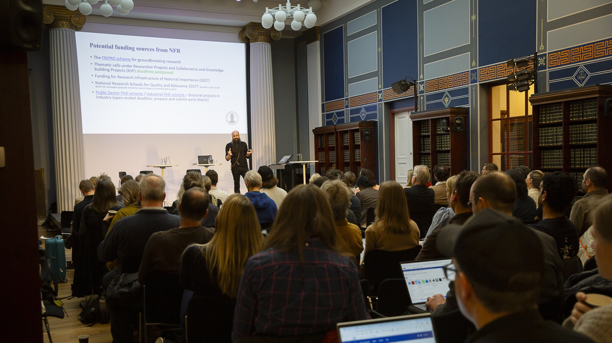

Many of the people present were eager to hear how the MishMash network can be leveraged in application processes. 

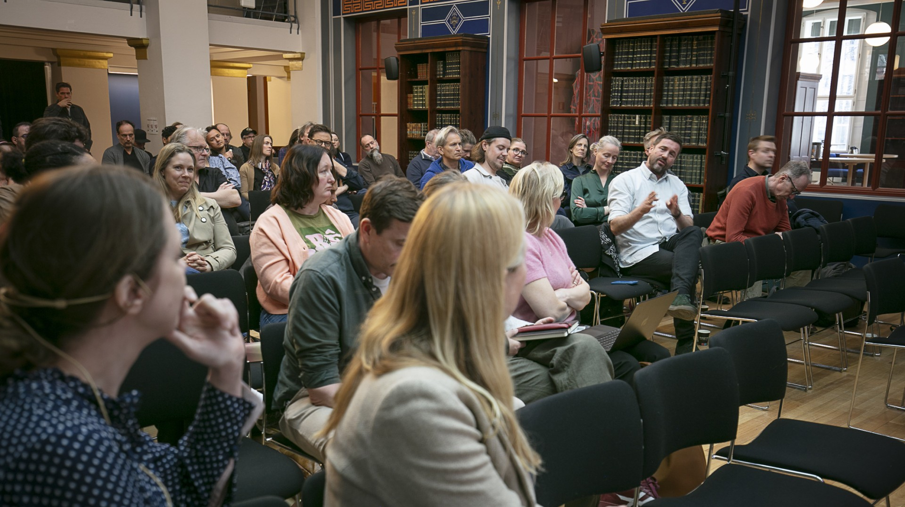

## Work package meetings

MishMash is organised into seven work packages, each with a different thematic focus. The first task is to get to know one another better. All work packages have begun online meeting series, and several of them met for the first time in person during the event.

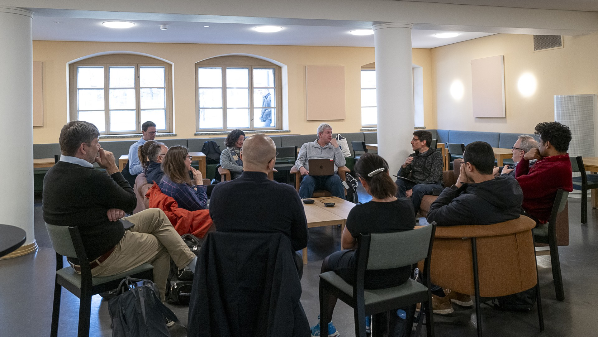

## Hackathon

In parallel to the other activities, Work Package 1 had initiated a [hackathon](https://mishmash.no/events/hackathon2026/) to explore the use of biosignals for controlling [RAVE](https://forum.ircam.fr/projects/detail/rave/), a system for audio processing and generation based on deep learning. A hackathon is an event where people come together to collaborate intensively on creating something new, most often software or hardware projects. The participants formed small teams that worked together during the day and with a final presentation at the end.

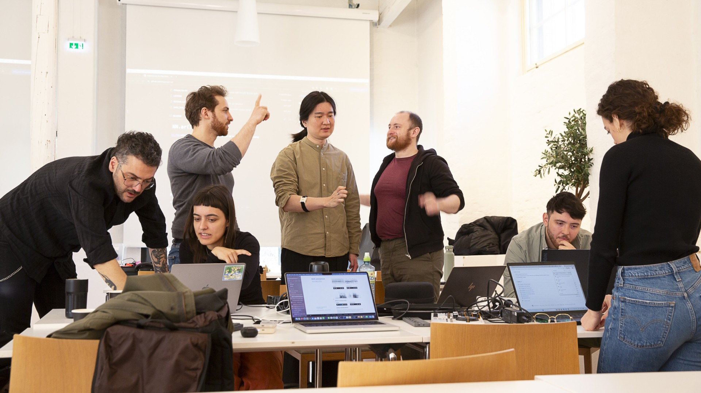

## Panel discussion: The impossible art

In the afternoon, Jon Marius Aareskjold-Drecker (UiO/UiT) organised [a panel discussion](https://mishmash.no/events/umuliges-kunst/) that brought together artists, editors, and researchers to debate the ethical and legal challenges posed by generative AI in the cultural sector.

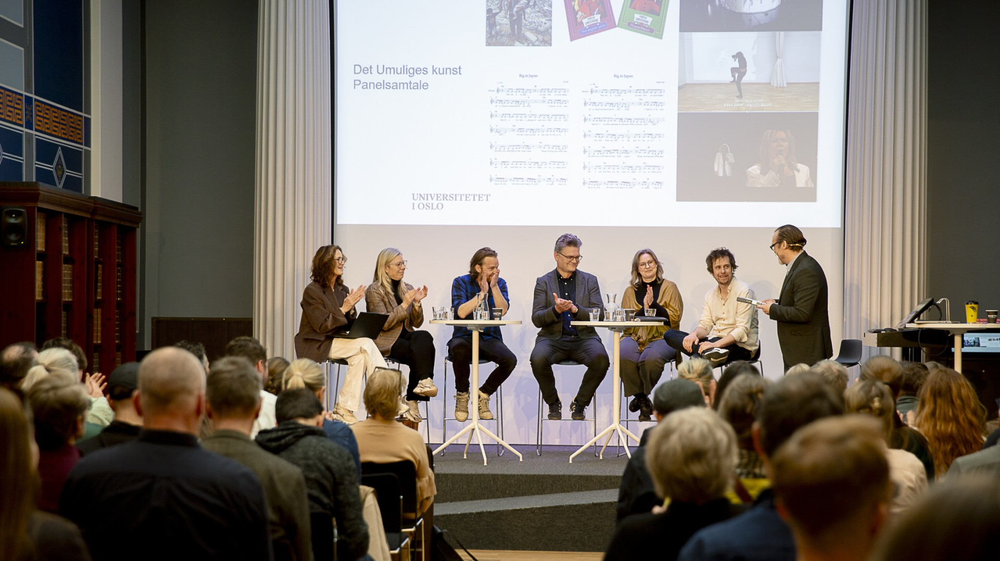

The discussion highlighted several critical concerns regarding the "shittification" of culture and the protection of artists' rights. Irina Eidsvold-Tøien (BI) raised the alarm on the use of AI to recreate deceased artists, such as Jan Werner Danielsen, arguing that the use of personal identity markers like voice and likeness should be protected as fundamental human rights. Flu Hartberg, a co-founder of the initiative KIKI, expressed strong skepticism toward AI "plagiarism monsters" that train on stolen data, citing a controversial AI-generated cover for a children’s book as a warning of declining artistic quality.

From the music and media industries, Ole Henrik Antonsen (TONO) discussed the difficulty of regulating powerful tech companies and the slow implementation of legal frameworks like the DSM Directive, while Trine Eilertsen shared how Aftenposten balances AI efficiency (such as automated transcription) with a strict commitment to human-led, verified journalism to combat AI-generated misinformation.

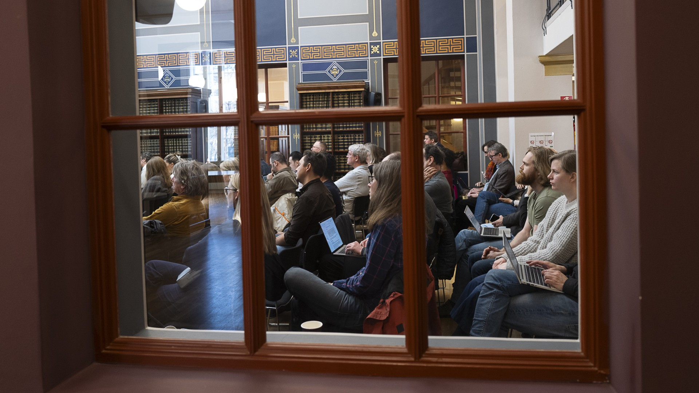

The panel also explored AI as an experimental tool. Benedicte Wallace (UiO) detailed the ethical complexities of using motion-capture data from dancers to train AI models, specifically regarding royalties and consent. Anders Hasmo presented a project from Det Norske Teatret that allowed audiences to interact with a Norwegian-speaking AI model, though he noted the theater avoided using current actors' voices for the AI to remain within ethical boundaries. The event concluded with a shared consensus on the urgent need for clear regulations and a "traffic light" system to protect human creativity from being overtaken by unregulated technology.

## Opening event: Artificial creativity

The climax of the day came with the [opening event](https://mishmash.no/events/aulaen2026/) in Aulaen, which began by introductory speeches by UiO Rector Ragnhild Hennum and Sigrun Aasland, Minister of Research and Higher Education. 

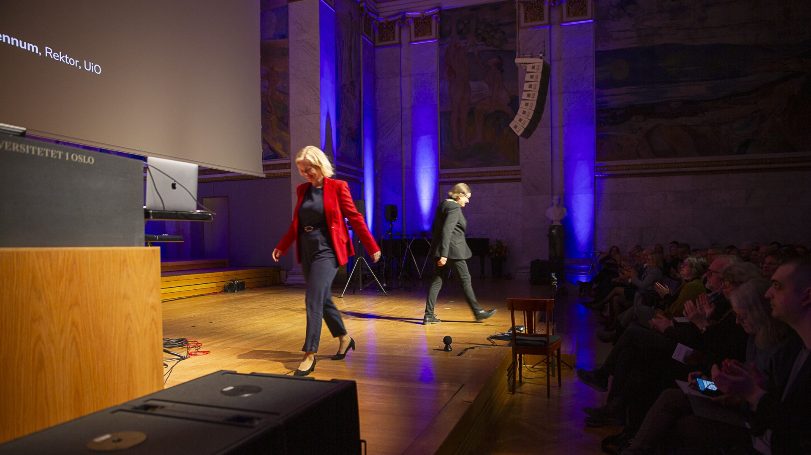

Then, MishMash Director Alexander Refsum Jensenius led the audience through a packed program while also telling the story of how MishMash is going to work between the different parts. 

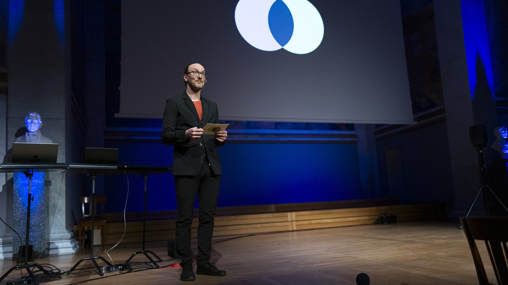

Violinist Victoria Johnson (UiO) and composer Anders Tveit (NMH) performed an excerpt from *Flytpunkt 1*, in which machine-learning agents listen and responded musically to live violin in real-time.

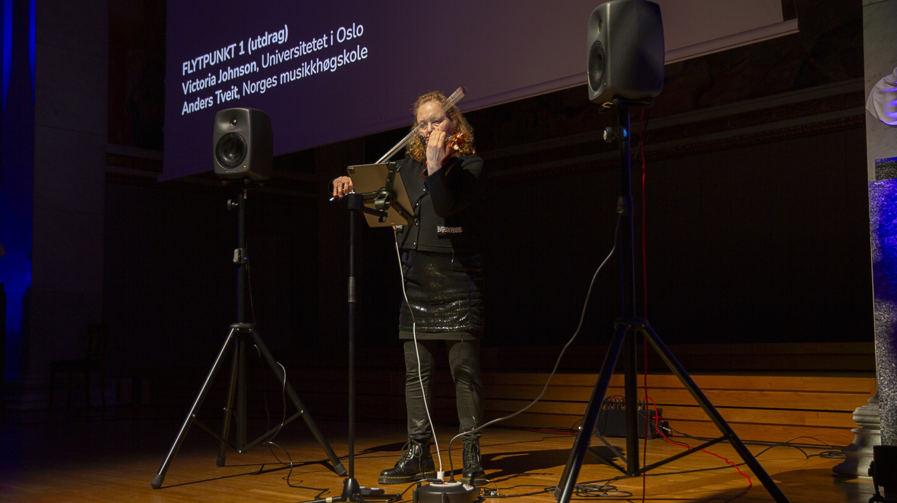

Dancer Diego Marin (UiO) and researcher Benedikte Wallace (UiO) performed *Dancing Embryo*, demonstrating a "kinematic relationship" between a human and a digital avatar.

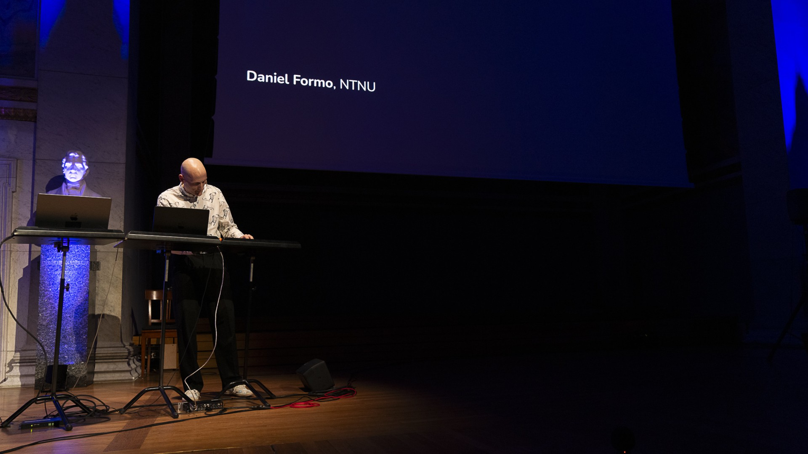

Daniel Formo (NTNU) presented an AI-based rhythmic improviser that is used for both performance and pedagogy. 

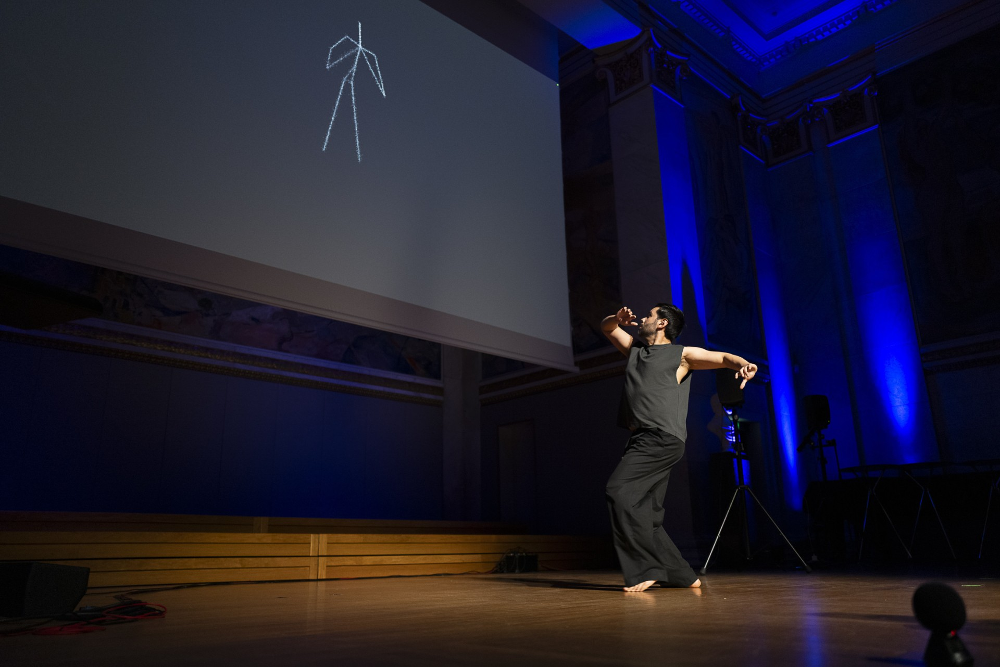

Joan Gatti performed *Skurdalsbruri* on the Hardanger fiddle while an AI system developed by Olivier Lartillot (UiO) and Lars Monstad visualized the music’s inner logic.

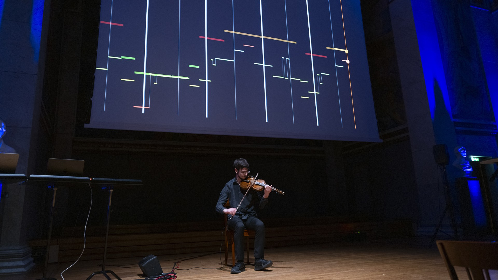

The event also featured two panel discussions. The first one, *Industry in Concern*, was moderated by Daniel Nordgård (UiA) and featured Øystein Strand (Arts Council Norway), Nina Frederikke Grünfeld (University of Inland Norway), and Andrew Melchior (freelance creative technologist). They discussed authorship, provenance, and the need to ensure due diligence regarding training data.

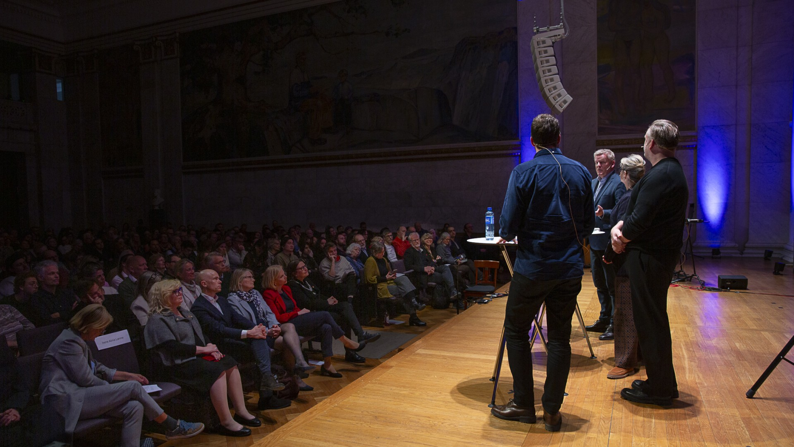

The second panel, *Knowledge, Culture, and AI* was moderated by Ida Jahr (INN), featuring the new National Librarian, Åse Wetås, Helge Jordheim (UiO), and Anne Kjersti Fahlvik (Research Council of Norway). They focused on cultural sustainability, warning against AI-generated "slopp" and the need to protect the Norwegian language and cultural heritage from being diluted by generic models.

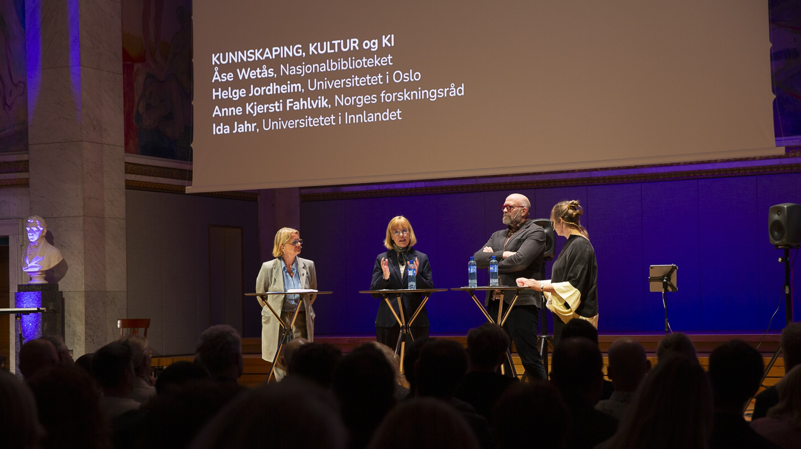

Combining artistic and scientific research methods is at the core of the MishMash vision. During the launch, Synne Tollerud Bull discussed how "artistic intelligence" can both challenge and improve "artificial intelligence", while Alexander Refsum Jensenius introduced the Artistic Readiness Level (ARL) framework to complement traditional technological metrics (TRL). ARL could ensure that artistic research and humanistic inquiry remain central to AI development.

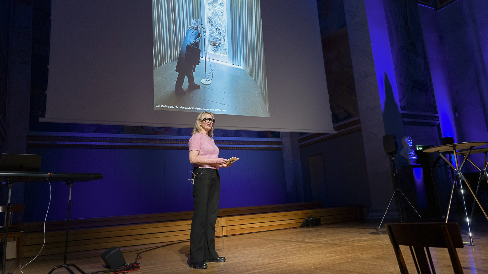

The evening ended with a massive audiovisual piece by Koka Nikoladze (NMH), who has developed a system for playing 4K video files like drums, highlighting both the brilliance and limitations of modern AI.

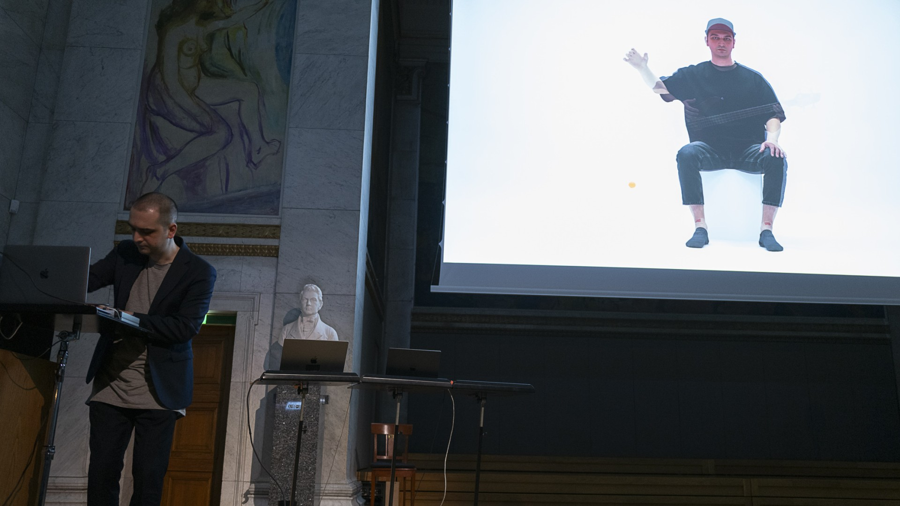

## Welcoming new partners and members

MishMash is now officially opened, and will serve as a hub for interdisciplinary and inter-institutional collaboration in the years to come. The initiative is meant to serve as a gravitational point for people interested in relevant topics. Both institutions and individuals are encouraged to participate. Please sign up on our [announcement mailing list](https://sympa.uio.no/mishmash.no/subscribe/announcements?previous_action=info) to be informed about upcoming things and [get in touch](mailto:contact@mishmash.no) if you want to contribute.

---
Photo credits: Annica Thomsson.