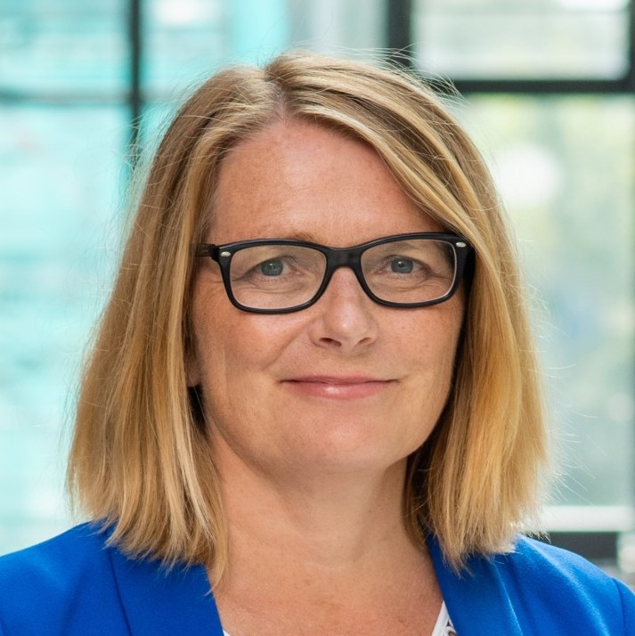
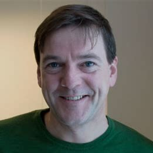
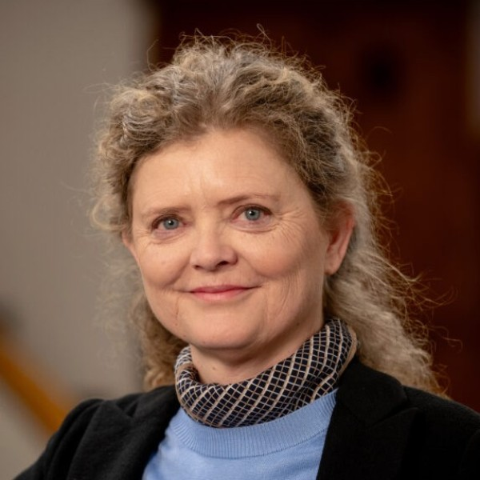
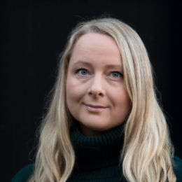

The MishMash Board provides governance and oversight of the centre's strategic directions and activities.

## Role

The Board is responsible for:

- Governance and oversight of MishMash
- Strategic decisions on the future direction of the centre
- Ensuring quality and impact of research
- Representation of partner institutions

## Members

- {: .person-thumb } [Sunniva Whittaker](https://www.uia.no/english/about-uia/employees/sunnivaw/) (University of Agder), leader
- {: .person-thumb } [Christian Blom](https://notam.no/en/about-us/employees/) (Notam – Norwegian Centre for Technology, Art and Music)
- {: .person-thumb } [Christian Schüssler](https://reimagine.no/contact) (Reimagine)
- {: .person-thumb } [Hege Stensrud Høsøien](https://www.nb.no/ansatte/hege-stensrud-hosoien/) (National Library of Norway)
- {: .person-thumb } [Tine Grieg Viig](https://www.hvl.no/person/?user=tine.viig) (Western Norway University of Applied Sciences)
- {: .person-thumb } [Alexander Refsum Jensenius](https://www.uio.no/ritmo/english/people/management/alexanje/) (University of Oslo), observer
- {: .person-thumb } [Eskil Muan Sæther](https://www.hf.uio.no/imv/english/people/adm/eskilms/index.html) (University of Oslo), secretary

## Documents

### Board Meeting Agendas and Protocols


