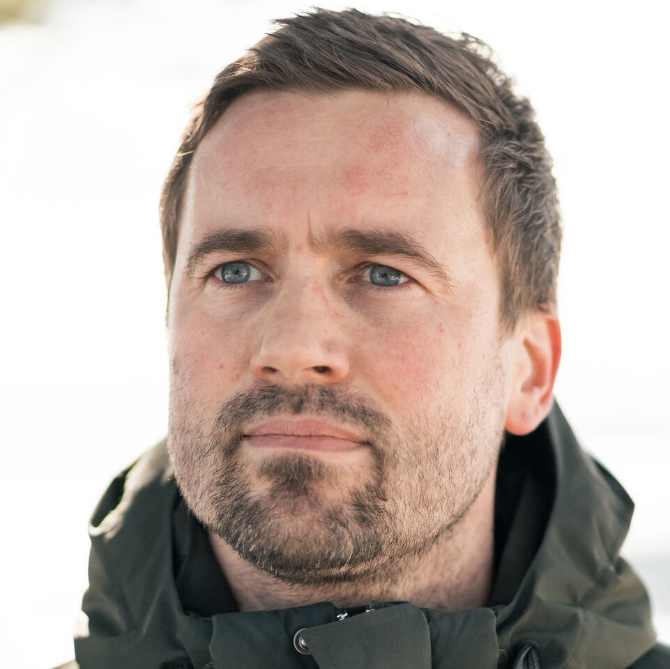
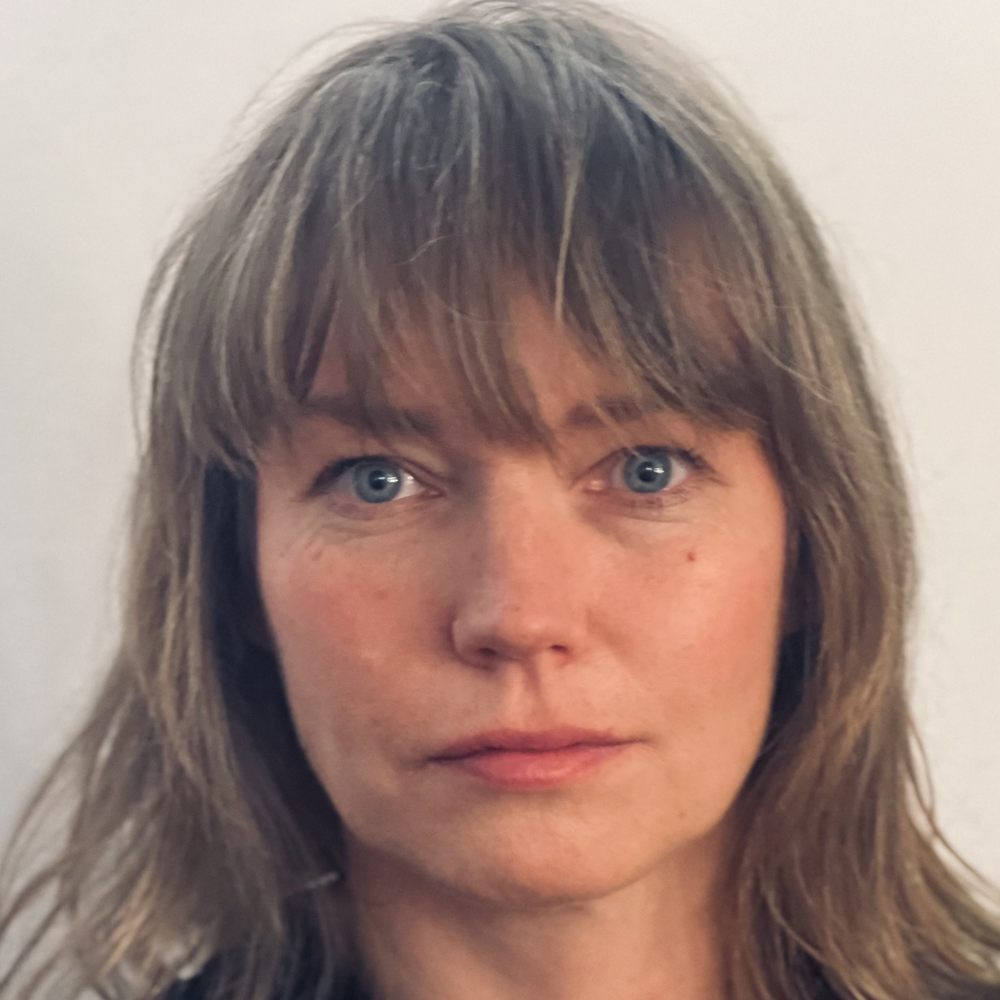
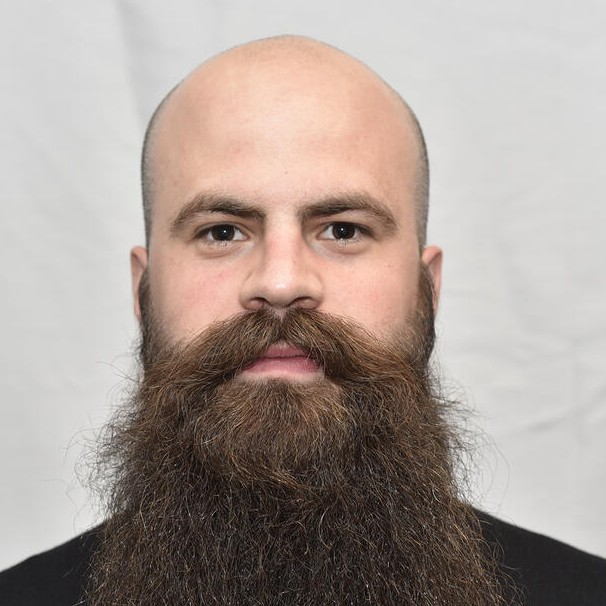
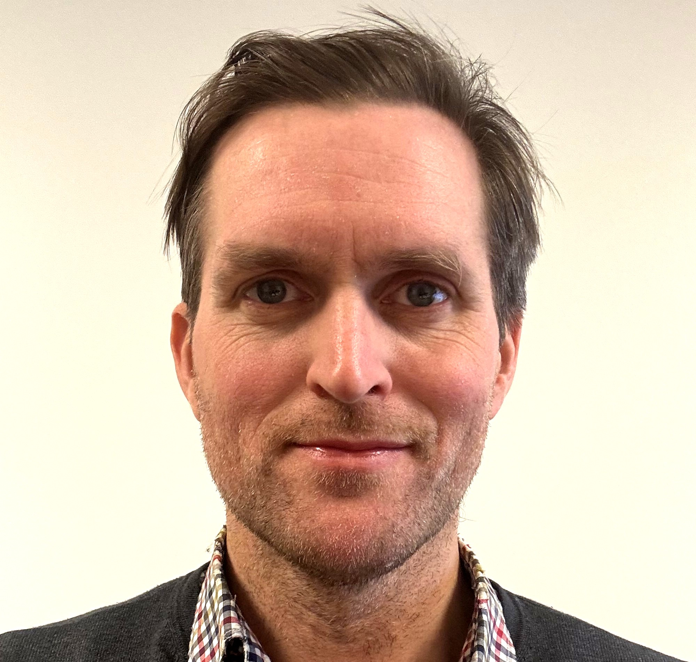

The Management group handles the day-to-day coordination and administration of MishMash activities.

## Role

The Management group is responsible for:

- Operational coordination across all work packages
- Administrative oversight
- Budget management and resource allocation
- Communication and dissemination of results

## Members

| | | | | |
| --- | --- | --- | --- | --- |
|  |  |  |  |  |
| [Alexander Refsum Jensenius](https://www.uio.no/ritmo/english/people/management/alexanje/) (UiO), Director | [Daniel Nordgård](https://www.uia.no/kk/profil/danieln) (UiA), Deputy director | [Ida Jahr](https://www.inn.no/english/find-an-employee/ida-jahr.html) (INN), Deputy director | [Thomas de Ridder](https://www.uib.no/personer/Thomas.de.Ridder) (UiB), Research advisor | [Eskil Muan Sæther](https://www.hf.uio.no/imv/english/people/adm/eskilms/index.html) (UiO), Administrative coordinator |

## Documents

*Relevant strategic documents and meeting minutes can be found here.*
