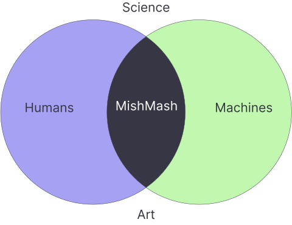
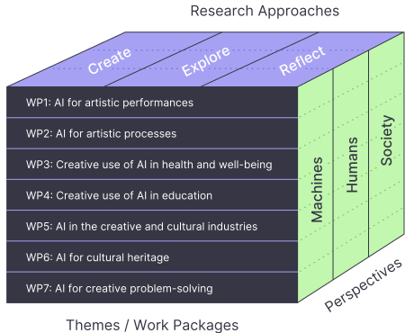
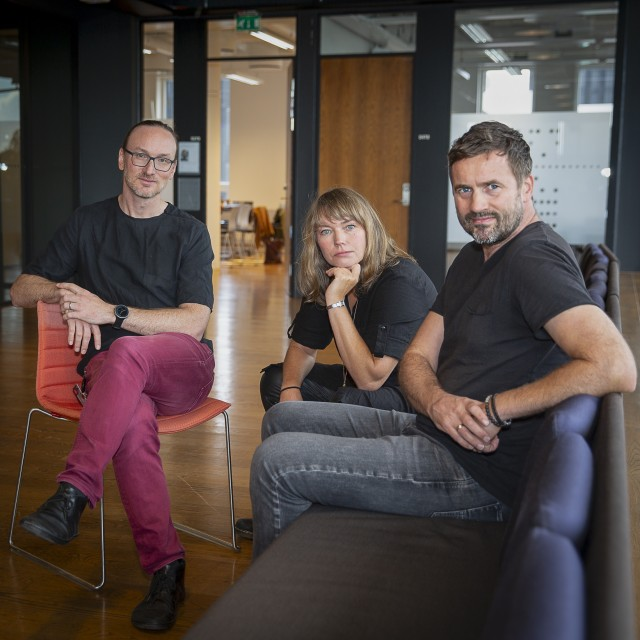

MishMash is a large Norwegian consortium dedicated to exploring the intersection of AI and creativity. Our primary objective is to **create, explore, and reflect on AI for, through, and in creative practices**. We will investigate AI's impact on creative processes, develop innovative CoCreative AI systems, and address AI's ethical, cultural, and societal implications in creative domains.

    

## Why?

Human creativity has both shaped and been shaped by technological developments. Today, human creativity faces unprecedented challenges and opportunities brought by **Creative AI**, machine systems that can produce results that are both novel and meaningful. This raises several important questions: to what extent are Creative AI systems genuinely creative, how do they differ from human creativity, and how can humans and machines be co‐creative? Furthermore, what are the societal implications of Creative AI, how will producers' and consumers' attitudes towards AI‐generated creative content develop, and how can creative approaches to AI have an impact beyond the cultural and creative sectors?

We view **artistic exploration** as an excellent entry point for engaging in critical discussions about AI and its implications for human‐machine interaction and society. Artistic research has been integral to computer‐based AI development since the early days of computer science, exemplified by early *rule‐based systems* for music composition and painting. Today, *learning-based systems* can produce all sorts of artistic products, and several have become popular commercial products, such as Dall‐E (images), ChatGPT (text), and Suno.ai (music). 

MishMash aims to expand current knowledge and pioneer new **CoCreative AI** systems that allow partnerships between humans and machines. We believe researchers and practitioners from creative disciplines are uniquely positioned to develop AI‐based technologies and to do so responsibly, reflecting on their ethical challenges and potential drawbacks. 

There are many possibilities with Creative and CoCreative AI systems, but also numerous challenges and knowledge needs:

- **Challenge 1:** How can we design and implement real‐time AI systems for immersive, dynamic, and ethical human‐machine collaborations in artistic performances?
- **Challenge 2:** How can artists integrate AI into their creative processes while maintaining control and addressing biases, cultural implications, and environmental impact?
- **Challenge 3:** How can AI‐generated content and Creative AI systems impact health and well‐being, and be integrated into therapeutic practices while considering empathy, consent, and equity?
- **Challenge 4:** How can Creative AI be integrated into education to enhance learning and foster AI literacy while considering diversity, justice, inclusion and well‐being?
- **Challenge 5:** How can AI enhance innovation in the creative and cultural industries while addressing copyright, rights management, ethical challenges, sustainability, and equitable revenue distribution?
- **Challenge 6:** How can AI enhance the preservation, accessibility, and representation of cultural heritage in archives, libraries, and museums while ensuring ethical and legal compliance?
- **Challenge 7:** How can Creative AI enhance human agency, control, and expression in problem‐solving while adhering to physical, legal, and societal constraints during the creative process?

## How?

MishMash will bring together a large multidisciplinary and cross-sectoral group of researchers and practitioners from the arts, humanities, social and natural sciences, design, and engineering. MishMash organises its theoretical and methodological "mishmash" into a structured "mesh," where projects and activities intersect across *themes*, *approaches*, and *perspectives*.

    

The WPs are designed around seven core *themes*, addressing the challenges outlined in the previous section. While some WPs focus on leveraging AI in creative—primarily artistic—applications, others explore the innovative use of AI in adjacent domains, fostering a dynamic interplay between art, science, and society. The work will be conducted by combining a multitude of scientific and arts-based theories and methods, which can be summarised in three interconnected *research approaches*:

- **CREATE:** making AI-based systems, tools, artworks, and related frameworks and policies. This includes theories and methods from computer science, engineering, and various types of art and design, emphasising creating CoCreative AI systems that prioritise human agency, environmental sustainability, and democratisation of AI technologies.
- **EXPLORE:** using AI-based systems in creative practice and seeing how creative methods can be applied in other domains. This includes investigating how AI can enhance creativity, foster innovation, and support learning and well-being using theories and methods from psychology, therapy, educational sciences, and cultural heritage.
- **REFLECT:** critically studying and discussing the impacts of AI on humans, human creativity, various cultures, and society at large. This includes theories and methods from the humanities and social sciences to ensure responsible AI development and use.

The centre will be a lively, virtual research environment, with weekly online meetings, biweekly work package check-ins, monthly thematic seminars, regular public workshops, life-long learning events, and bi-annual symposia with lectures, performances, and exhibitions.

## What?

- [WP1: AI for artistic performances](/wp1) — Focus on real‑time, multi‑agent and embodied AI for live music, art and interactive installations, enabling synchronous, improvisational human–machine collaboration with controllable, personalised expressive outputs, explainability, embodied sensing, and ethically inclusive designs for spontaneous co‑creation.

- [WP2: AI in artistic processes](/wp2) — Study how generative and prompt‑based AI integrate into production workflows across visual arts, film, VR/XR, music and games, defend artist autonomy and cultural diversity against homogenisation and bias, and develop artist‑centred tools and practices that address ethical and legal concerns.

- [WP3: Creative use of AI for health and well‑being](/wp3) — Examine effects of AI‑generated creative content and AI‑supported arts therapies on mental and physical well‑being, co‑design inclusive, disability‑aware interventions and evaluation methods, and prioritise ethical practices around consent, equity and responsible therapeutic use.

- [WP4: Creative use of AI in education](/wp4) — Develop pedagogical materials, curricula and AI literacy resources (with emphasis on Norwegian availability) to integrate Creative AI across formal and lifelong learning, explore artistic applications for teaching and learning, and foreground ethics, inclusion, privacy and accessibility.

- [WP5: AI in the Creative and Cultural Industries](/wp5) — Investigate legal, ethical and environmental implications of training and deploying Creative AI (copyright, rights management, revenue models, privacy), propose sustainable business and regulatory frameworks including rights infrastructures, and produce dissemination and commercialization pathways with LCA analysis.

- [WP6: AI for cultural heritage](/wp6) — Build hybrid AI solutions (ML + symbolic/musicological methods) for automated transcription, classification, interlinking and presentation of archives and collections, emphasising minority cultural expressions, ethical public‑sector stewardship, and policies to prevent exploitative uses while enhancing discoverability and rights tracking.

- [WP7: Human‑centric AI for Creative Problem‑Solving](/wp7) — Create goal‑oriented Creative AI frameworks and interfaces that empower practitioners (designers, filmmakers, industrial operators, emergency responders) by supporting surprise, control and evaluation within practical constraints, encoding physical/legal/ethical bounds, and ensuring agency, transparency and transferability.

## When?

The plan is to formally start the centre in December 2025, recruit doctoral and postdoctoral fellows during the spring of 2026 and get up to full speed from the autumn of 2026. 

## Who?

### Management group

- [Alexander Refsum Jensenius](https://www.uio.no/ritmo/english/people/management/alexanje/) (UiO), Director
- [Daniel Nordgård](https://www.uia.no/kk/profil/danieln) (UiA), Deputy director
- [Ida Jahr](https://www.inn.no/english/find-an-employee/ida-jahr.html) (INN), Deputy director
- [Thomas de Ridder](https://www.uib.no/personer/Thomas.de.Ridder) (UiB), Research advisor
- [Nina Rundgren](https://www.hf.uio.no/imv/english/people/adm/ninarund/index.html) (UiO), Head of administration

*MishMash will be directed by [Alexander Refsum Jensenius](https://www.uio.no/ritmo/english/people/management/alexanje/) (UiO) together with deputy directors [Ida Jahr](https://www.inn.no/english/find-an-employee/ida-jahr.html) (INN) and [Daniel Nordgård](https://www.uia.no/kk/profil/danieln) (UiA). (Photo: UiO)*

### Work package leaders

| Work Package                                      | Lead                                                                                                                                         | Sidekick 1                                                                                                                        | Sidekick 2                                                                                                                        |
|---------------------------------------------------|----------------------------------------------------------------------------------------------------------------------------------------------|------------------------------------------------------------------------------------------------------------------------------------|------------------------------------------------------------------------------------------------------------------------------------|
| **WP1: AI for artistic performances**             | [Kyrre Glette](https://www.mn.uio.no/ifi/english/people/aca/kyrrehg/index.html) (UiO)                                                        | [Ivar Grydeland](https://nmh.no/kontakt-oss/ansatte/ivar-grydeland) (NMH)                                                     | [Georgios Marentakis](https://www.hiof.no/iio/itk/english/people/aca/georgiom/index.html) (HiØ)                                   |
| **WP2: AI in artistic processes**                 | [Budhaditya Chattopadhyay](https://www.uib.no/en/persons/Budhaditya.Chattopadhyay) (UiB)                                                     | [Sashi Komandur](https://www.inn.no/english/find-an-employee/sashi-komandur.html) (INN)                                            | [Synne Tollerud Bull](https://www.kristiania.no/en/about-kristiania/employees/school-of-arts-design-and-media/westerdals-department-of-film-and-media/synne-tollerud-bull/) (Kristiania) |
| **WP3: Creative use of AI for health and well-being** | [Claire Ghetti](https://www.uib.no/en/persons/Claire.Ghetti) (UiB)                                                                          | [Andreas Bergsland](https://www.ntnu.edu/employees/andreas.bergsland) (NTNU)                                                      | [Jonna Vuoskoski](https://www.hf.uio.no/imv/english/people/aca/tenured/jonnakv/index.html) (UiO)                                  |
| **WP4: Creative use of AI in education**          | [Eirik Sørbø](https://www.uia.no/english/about-uia/employees/eiriks05/) (UiA)                                                   | [Sidsel Karlsen](https://nmh.no/en/contact-us/employees/sidsel-karlsen) (NMH)                                                     | [Fredrik Graver](https://www.inn.no/english/find-an-employee/fredrik-graver.html) (INN)                                           |
| **WP5: AI in the Creative and Cultural Industries** | [Ragnhild Brøvig](https://www.hf.uio.no/imv/english/people/aca/tenured/ragnhiba/index.html) (UiO)                                            | [Irina Eidsvold-Tøien](https://www.bi.no/en/about-bi/employees/department-of-law2/irina-eidsvold-toien/) (BI)                     | [Jon Marius Aareskjold-Drecker](https://en.uit.no/ansatte/person?p_document_id=93949&p_dimension_id=88175) (UiT)                  |
| **WP6: AI for cultural heritage**                 | [Ingrid Romarheim Haugen](https://www.nb.no/ansatte/ingrid-romarheim-haugen/) (NB)                                                           | [Arnulf Mattes](https://www4.uib.no/en/find-employees/Arnulf.Christian.Mattes) (UiB)                                              | [Olivier Lartillot](https://www.uio.no/ritmo/english/people/tenured/oliviel/index.html) (UiO)                                     |
| **WP7: Human-centric AI for Creative Problem-Solving** | [Carsten Griwodz](https://www.mn.uio.no/ifi/english/people/aca/griff/index.html) (UiO)                                                      | [Baltasar Beferull‐Lozano](https://www.simula.no/people/baltasar) (SimulaMet)                                                     | [Kjetil Nordby](https://www.aho.no/english/about/employees/kjetiln/) (AHO)                                                       |

### Scientific Advisory Board

- [Benoit Maujean](https://www.linkedin.com/in/benoit-maujean-7b2b2a1/) (Head of Technicolor Research, France)
- [Catherine Fisk](https://www.law.berkeley.edu/our-faculty/faculty-profiles/catherine-fisk/) (Prof. law, UC Berkeley, USA)
- [Jon McCormack](https://research.monash.edu/en/persons/jon-mccormack) (Prof. creative computing, Monash University, Australia)
- [Jyoti Mistry](https://www.gu.se/en/about/find-staff/jyotimistry) (Prof. film, Gothenburg University, Sweden)
- [Nancy Baym](https://www.microsoft.com/en-us/research/people/baym/) (Senior Principal Research Manager, Microsoft, New England, USA)
- [Pamela Burnard](https://www.educ.cam.ac.uk/people/staff/burnard/) (Prof. arts, creativities and educations, University of Cambridge, UK)
- [Philippe Pasquier](https://www.sfu.ca/siat/people/research-faculty/philippe-pasquier.html) (Prof. interactive arts and technology, Simon Fraser University, Canada)
- [Psyche Loui](https://web.northeastern.edu/creativity/) (Assoc. Prof. creativity and creative practice, Northeastern University, USA)
- [Ravi Kiran Sarvadevabhatla](https://www.iiit.ac.in/faculty/ravi-kiran-sarvadevabhatla/) (Assoc. Prof. computer vision and machine learning, IIIT Hyderabad, India)
- [Sebastian Risi](https://sebastianrisi.com/) (Prof. creative AI, IT University of Copenhagen, Denmark)
- [Xavier Serra](https://www.upf.edu/web/xavier-serra) (Prof. music technology, Universitat Pompeu Fabra, Spain)
- [Zhang Qian](https://mra.cuc.edu.cn/yy/2023/0428/c9672a206535/page.htm) (Prof. music and recording art, Communication University of China, China)

### Partners

---

    
+ Norwegian research partners

    <ul>
        <li><a href="https://www.aho.no/english/">The Oslo School of Architecture and Design (AHO)</a></li>
        <li><a href="https://www.bi.edu/">Norwegian Business School (BI)</a></li>
        <li><a href="https://www.hiof.no/english/">Østfold University College (HiØ)</a></li>
        <li><a href="https://www.hvl.no/en/">Western Norway University of Applied Sciences (HVL)</a></li>
        <li><a href="https://www.inn.no/english/">University of Inland Norway (INN)</a></li>
        <li><a href="https://khio.no/en">The Oslo National Academy of the Arts (KHiO)</a></li>
        <li><a href="https://www.kristiania.no/en/">Kristiania University College (Kristiania)</a></li>
        <li><a href="https://www.nb.no/">National Library of Norway (In Norwegian)</a></li>
        <li><a href="https://nilu.com/">The Climate and Environmental Research Institute (NILU)</a></li>
        <li><a href="https://www.nla.no/en/">NLA University College (NLA)</a></li>
        <li><a href="https://nmh.no/en/">Norwegian Academy of Music (NMH)</a></li>
        <li><a href="https://www.nord.no/en">Nord University (Nord)</a></li>
        <li><a href="https://norsus.no/en/">Norwegian Institute for Sustainability Research (NORSUS)</a></li>
        <li><a href="https://www.ntnu.edu/">Norwegian University of Science and Technology (NTNU)</a></li>
        <li><a href="https://www.oslomet.no/en">Oslo Metropolitan University (OsloMet)</a></li>
        <li><a href="https://www.simulamet.no/">Simula Research Laboratory (SIMULAMET)</a></li>
        <li><a href="https://www.sintef.no/en/">The Foundation for Industrial and Technical Research (SINTEF)</a></li>
        <li><a href="https://www.uia.no/english/index.html">University of Agder (UiA)</a></li>
        <li><a href="https://www.uib.no/en">University of Bergen (UiB)</a></li>
        <li><a href="https://www.uio.no/english/index.html">University of Oslo (UiO)</a></li>
        <li><a href="https://en.uit.no/">University of Tromsø (UiT)</a></li>
    </ul>

---

    
+ Other Norwegian partners

    
In alphabetical order:

    <ul>
        <li><a href="https://akks.no/">AKKS Norge (In Norwegian)</a></li>
        <li><a href="https://annomuseum.no/en">ANNO</a></li>
        <li><a href="https://ateliernord.no/?lang=en">Atelier Nord</a></li>
        <li><a href="https://bek.no/en/">BEK</a></li>
        <li><a href="https://www.fib.no/en">Bergen International Festival</a></li>
        <li><a href="https://www.borealisfestival.no/en/home/">Borealis</a></li>
        <li><a href="https://www.cultiva.no/en/">Cultiva</a></li>
        <li><a href="https://dhko.no/en">DHKO</a></li>
        <li><a href="https://www.fyndreality.com/">Fynd Reality AS</a></li>
        <li><a href="https://www.gramart.no/">GramArt (In Norwegian)</a></li>
        <li><a href="https://en.gramo.no/">GRAMO</a></li>
        <li><a href="https://halogen.no/en/">Halogen AS</a></li>
        <li><a href="https://hamarregionen.no/move-to-the-hamar-region/">Hamarregionen utvikling</a></li>
        <li><a href="https://helseinn.no/">HelseINN (In Norwegian)</a></li>
        <li><a href="https://www.jmn.no/eng">JM Norway</a></li>
        <li><a href="https://kilden.com/en/">Kilden Performing Arts Centre</a></li>
        <li><a href="https://www.kodebergen.no/en">KODE Bergen Art Museum</a></li>
        <li><a href="https://www.kunstsilo.no/en">Kunstsilo</a></li>
        <li><a href="https://kulturskoleradet.no/">Kulturskolerådet (In Norwegian)</a></li>
        <li><a href="https://www.kulturtanken.no/">Kulturtanken (In Norwegian)</a></li>
        <li><a href="https://mediacitybergen.no/">Media Cluster Norway AS</a></li>
        <li>Multikjetil AS</li>
        <li><a href="https://www.nasjonalmuseet.no/en/">Nasjonalmuseet</a></li>
        <li><a href="https://kunstkultursenteret.no/english/">Norwegian Centre for Arts and Culture in Education (NCACE)</a></li>
        <li><a href="https://notam.no/en/">Notam</a></li>
        <li><a href="https://nopa.no/english/">Norwegian Society of Composers and Lyricists (NOPA)</a></li>
        <li><a href="https://www.naic.no/english/">Norwegian AI Cloud (NAIC)</a></li>
        <li><a href="https://www.nrk.no/">Norwegian Broadcasting Corporation (NRK) (In Norwegian)</a></li>
        <li><a href="https://www.kreativai.no/">Oslo Kreativ AI (OKAI)</a></li>
        <li><a href="https://polyfon.no/en_US/">Polyfon</a></li>
        <li><a href="https://punktfestival.no/">PUNKT</a></li>
        <li><a href="https://reimagine.no/">Reimagine AS</a></li>
        <li><a href="https://sareptastudio.com/">Sarepta Studio AS</a></li>
        <li><a href="https://skapia.no/">Skapia (In Norwegian)</a></li>
        <li><a href="https://innlandetfylke.no/">Skolene i Innlandet (In Norwegian)</a></li>
        <li><a href="https://www.storyphone.no/">StoryPhone AS (In Norwegian)</a></li>
        <li><a href="https://www.tekniskmuseum.no/en/">Oslo Science Centre</a></li>
        <li><a href="https://teks.no/">TEKS</a></li>
        <li><a href="https://www.tono.no/en/">TONO</a></li>
        <li><a href="https://www.ultima.no/en/">Ultima – Oslo Contemporary Music Festival</a></li>
        <li><a href="https://www.vestagdermuseet.no/">Vest‐Agder Museum</a></li>
        <li><a href="https://vrinn.no/">VRINN</a></li>
    </ul>

---

    
+ International partners

Numerous international academic and non-academic partners will also be involved, and we will set up an affiliate program for others to join the network and participate in relevant activities. 

---

## Funding

    

## More information

- Subscribe to our (low-volume) [mailing list](https://sympa.uio.no/mishmash.no/subscribe/announcements?previous_action=info) for information about events and job openings
- Follow us on [LinkedIn page](https://www.linkedin.com/company/107529241/) and [Instagram](https://www.instagram.com/aimishmash/)
- Get in touch directly with someone in the [leader group](https://mishmash.no/#who) to discuss how to be involved