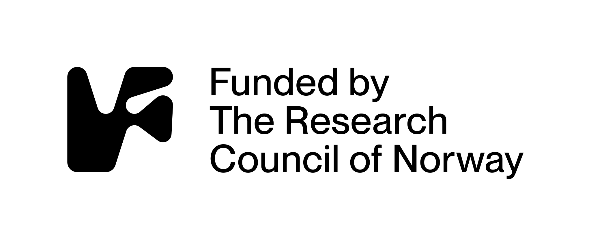

    

MishMash is a Norwegian AI centre comprising more than 200 researchers from higher education institutions in Norway, in collaboration with numerous public and private sector partners. The primary objective of MishMash is to **create, explore, and reflect on AI for, through, and in creative practices**. MishMash researchers investigate AI's impact on creative processes, develop innovative co-creative AI systems and educational strategies, and address AI’s ethical, cultural, legal, and societal implications in creative domains. [More about MishMash...](https://mishmash.no/about/)

<h2><a href="https://mishmash.no/events/">MishMash Events</a></h2>



[More MishMash events...](https://mishmash.no/events/)

<h2><a href="https://mishmash.no/events/partner-events">Partner Events</a></h2>



[More partner events...](https://mishmash.no/events/partner-events)

<h2><a href="https://mishmash.no/news/">News</a></h2>



[More news...](https://mishmash.no/news/)

## Vacancies

Check the list of [open positions](https://mishmash.no/news/positions/). Get in [touch](https://mishmash.no/people/) if you are interested in applying to an external fellowship program through one of our parners (for example, Marie Skłodowska-Curie Actions fellowships or Fulbright). Partners are also open for hosting self-funded internships (for example through the ERASMUS programme).

## Partners

---

    
+ Norwegian research partners

    <ul>
        <li><a href="https://www.aho.no/english/">The Oslo School of Architecture and Design (AHO)</a></li>
        <li><a href="https://www.bi.edu/">Norwegian Business School (BI)</a></li>
        <li><a href="https://www.hiof.no/english/">Østfold University College (HiØ)</a></li>
        <li><a href="https://www.hvl.no/en/">Western Norway University of Applied Sciences (HVL)</a></li>
        <li><a href="https://www.inn.no/english/">University of Inland Norway (INN)</a></li>
        <li><a href="https://khio.no/en">The Oslo National Academy of the Arts (KHiO)</a></li>
        <li><a href="https://www.kristiania.no/en/">Kristiania University College (Kristiania)</a></li>
        <li><a href="https://www.nb.no/en/">National Library of Norway</a></li>
        <li><a href="https://nilu.com/">The Climate and Environmental Research Institute (NILU)</a></li>
        <li><a href="https://www.nla.no/en/">NLA University College (NLA)</a></li>
        <li><a href="https://nmh.no/en/">Norwegian Academy of Music (NMH)</a></li>
        <li><a href="https://www.nord.no/en">Nord University (Nord)</a></li>
        <li><a href="https://norsus.no/en/">Norwegian Institute for Sustainability Research (NORSUS)</a></li>
        <li><a href="https://www.ntnu.edu/">Norwegian University of Science and Technology (NTNU)</a></li>
        <li><a href="https://www.oslomet.no/en">Oslo Metropolitan University (OsloMet)</a></li>
        <li><a href="https://www.simulamet.no/">Simula Research Laboratory (SIMULAMET)</a></li>
        <li><a href="https://www.sintef.no/en/">The Foundation for Industrial and Technical Research (SINTEF)</a></li>
        <li><a href="https://www.uia.no/english/index.html">University of Agder (UiA)</a></li>
        <li><a href="https://www.uib.no/en">University of Bergen (UiB)</a></li>
        <li><a href="https://www.uio.no/english/index.html">University of Oslo (UiO)</a></li>
        <li><a href="https://en.uit.no/">University of Tromsø (UiT)</a></li>
    </ul>

---

    
+ Other Norwegian partners

    
In alphabetical order:

    <ul>
        <li><a href="https://akks.no/">AKKS Norge (In Norwegian)</a></li>
        <li><a href="https://annomuseum.no/en">ANNO</a></li>
        <li><a href="https://ateliernord.no/?lang=en">Atelier Nord</a></li>
        <li><a href="https://bek.no/en/">BEK</a></li>
        <li><a href="https://www.fib.no/en">Bergen International Festival</a></li>
        <li><a href="https://www.borealisfestival.no/en/home/">Borealis</a></li>
        <li><a href="https://www.cultiva.no/en/">Cultiva</a></li>
        <li><a href="https://dhko.no/en">DHKO</a></li>
        <li><a href="https://www.fyndreality.com/">Fynd Reality AS</a></li>
        <li><a href="https://www.gramart.no/">GramArt (In Norwegian)</a></li>
        <li><a href="https://en.gramo.no/">GRAMO</a></li>
        <li><a href="https://halogen.no/en/">Halogen AS</a></li>
        <li><a href="https://hamarregionen.no/move-to-the-hamar-region/">Hamarregionen utvikling</a></li>
        <li><a href="https://helseinn.no/">HelseINN (In Norwegian)</a></li>
        <li><a href="https://www.jmn.no/eng">JM Norway</a></li>
        <li><a href="https://kilden.com/en/">Kilden Performing Arts Centre</a></li>
        <li><a href="https://www.kodebergen.no/en">KODE Bergen Art Museum</a></li>
        <li><a href="https://www.kunstsilo.no/en">Kunstsilo</a></li>
        <li><a href="https://kulturskoleradet.no/">Kulturskolerådet (In Norwegian)</a></li>
        <li><a href="https://www.kulturtanken.no/">Kulturtanken (In Norwegian)</a></li>
        <li><a href="https://mediacitybergen.no/">Media Cluster Norway AS</a></li>
        <li>Multikjetil AS</li>
        <li><a href="https://www.nasjonalmuseet.no/en/">Nasjonalmuseet</a></li>
        <li><a href="https://kunstkultursenteret.no/english/">Norwegian Centre for Arts and Culture in Education (NCACE)</a></li>
        <li><a href="https://notam.no/en/">Notam</a></li>
        <li><a href="https://nopa.no/english/">Norwegian Society of Composers and Lyricists (NOPA)</a></li>
        <li><a href="https://www.naic.no/english/">Norwegian AI Cloud (NAIC)</a></li>
        <li><a href="https://www.nrk.no/">Norwegian Broadcasting Corporation (NRK) (In Norwegian)</a></li>
        <li><a href="https://www.kreativai.no/">Oslo Kreativ AI (OKAI)</a></li>
        <li><a href="https://polyfon.no/en_US/">Polyfon</a></li>
        <li><a href="https://punktfestival.no/">PUNKT</a></li>
        <li><a href="https://reimagine.no/">Reimagine AS</a></li>
        <li><a href="https://sareptastudio.com/">Sarepta Studio AS</a></li>
        <li><a href="https://skapia.no/">Skapia (In Norwegian)</a></li>
        <li><a href="https://innlandetfylke.no/">Skolene i Innlandet (In Norwegian)</a></li>
        <li><a href="https://www.storyphone.no/">StoryPhone AS (In Norwegian)</a></li>
        <li><a href="https://www.tekniskmuseum.no/en/">Oslo Science Centre</a></li>
        <li><a href="https://teks.no/">TEKS</a></li>
        <li><a href="https://www.tono.no/en/">TONO</a></li>
        <li><a href="https://www.ultima.no/en/">Ultima – Oslo Contemporary Music Festival</a></li>
        <li><a href="https://www.vestagdermuseet.no/">Vest‐Agder Museum</a></li>
        <li><a href="https://vrinn.no/">VRINN</a></li>
    </ul>

---

    
+ International partners

Numerous international academic and non-academic partners will also be involved, and we will set up an affiliate program for others to join the network and participate in relevant activities. 

---

    
    <a class="social-icon-link" href="mailto:contact@mishmash.no" style="text-align:center;width:100px;display:inline-block;">
        
        Contact
    </a>
    <a class="social-icon-link" href="https://sympa.uio.no/mishmash.no/subscribe/announcements?previous_action=info" style="text-align:center;width:100px;display:inline-block;">
        
        Mailing list
    </a>
    <a class="social-icon-link" href="https://www.linkedin.com/company/107529241/" style="text-align:center;width:100px;display:inline-block;">
        
        LinkedIn
    </a>
    <a class="social-icon-link" href="https://www.instagram.com/aimishmash/" style="text-align:center;width:100px;display:inline-block;">
        
        Instagram
    </a>
    <a class="social-icon-link" href="https://github.com/MishMash-Norway/" style="text-align:center;width:100px;display:inline-block;">
        
        GitHub
    </a>
    <a class="social-icon-link" href="https://www.youtube.com/@MishMashNorway" style="text-align:center;width:100px;display:inline-block;">
        
        YouTube
    </a>
    <a class="social-icon-link" href="/news/feed.xml" style="text-align:center;width:100px;display:inline-block;">
        
        News RSS
    </a>
    <a class="social-icon-link" href="/events/calendar.ics" style="text-align:center;width:100px;display:inline-block;">
        
        iCal
    </a>

