# Work Package Leader Group

The Work Package Leader Group consists of the leaders and co-leaders of MishMash's seven scientific work packages.

## Role

The Work Package Leader Group is responsible for:
- Scientific direction and coordination of individual work packages
- Ensuring research quality and progress
- Cross-work-package collaboration and knowledge exchange
- Dissemination of research results

## Members

| Work Package    | Lead          | Sidekick 1          | Sidekick 2      |
|-------|------------------|-------------------------|----------------|
| **WP1: AI for artistic performances**             | 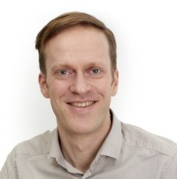 [Kyrre Glette](https://www.mn.uio.no/ifi/english/people/aca/kyrrehg/index.html) (UiO)                                                        | 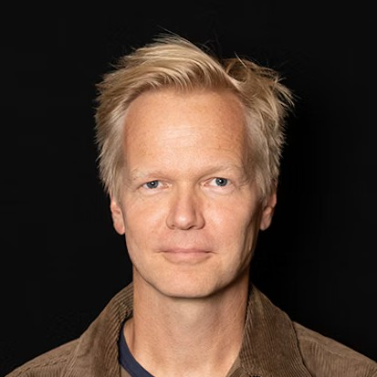 [Ivar Grydeland](https://nmh.no/kontakt-oss/ansatte/ivar-grydeland) (NMH)                                                     | 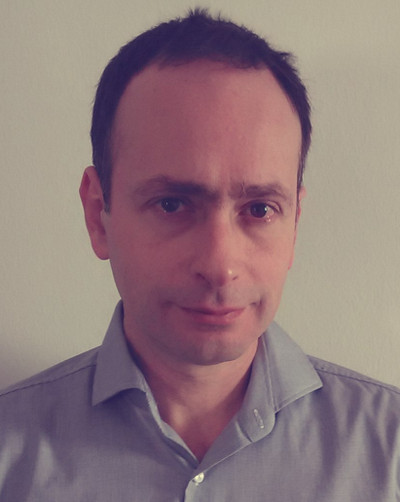 [Georgios Marentakis](https://www.hiof.no/iio/itk/english/people/aca/georgiom/index.html) (HiØ)                                   |
| **WP2: AI in artistic processes**                 | 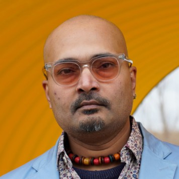 [Budhaditya Chattopadhyay](https://www.uib.no/en/persons/Budhaditya.Chattopadhyay) (UiB)                                                     | 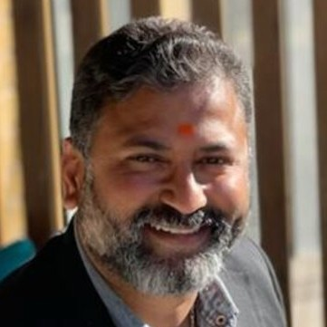 [Sashi Komandur](https://www.inn.no/english/find-an-employee/sashi-komandur.html) (INN)                                            | 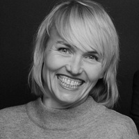 [Synne Tollerud Bull](https://www.kristiania.no/en/about-kristiania/employees/school-of-arts-design-and-media/westerdals-department-of-film-and-media/synne-tollerud-bull/) (Kristiania) |
| **WP3: Creative use of AI for health and well-being** | 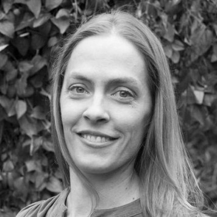 [Claire Ghetti](https://www.uib.no/en/persons/Claire.Ghetti) (UiB)                                                                          | 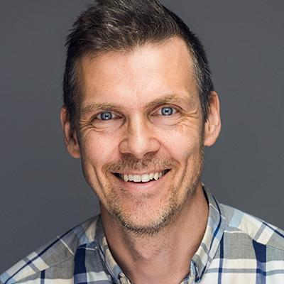 [Andreas Bergsland](https://www.ntnu.edu/employees/andreas.bergsland) (NTNU)                                                      |  [Jonna Vuoskoski](https://www.hf.uio.no/imv/english/people/aca/tenured/jonnakv/index.html) (UiO)                                  |
| **WP4: Creative use of AI in education**          | 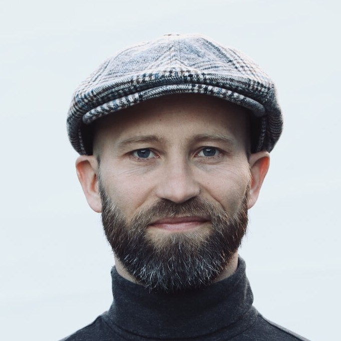 [Eirik Sørbø](https://www.uia.no/english/about-uia/employees/eiriks05/) (UiA)                                                   | 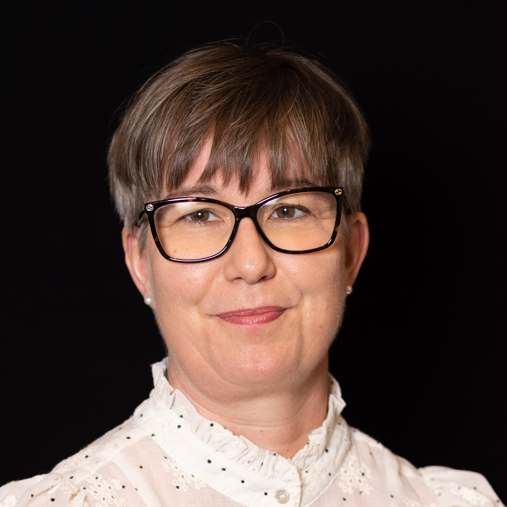 [Sidsel Karlsen](https://nmh.no/en/contact-us/employees/sidsel-karlsen) (NMH)                                                     |  [Fredrik Graver](https://www.inn.no/english/find-an-employee/fredrik-graver.html) (INN)                                           |
| **WP5: AI in the Creative and Cultural Industries** |  [Ragnhild Brøvig](https://www.hf.uio.no/imv/english/people/aca/tenured/ragnhiba/index.html) (UiO)                                            | 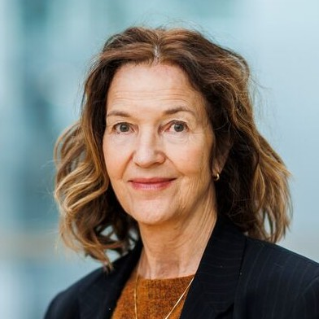 [Irina Eidsvold-Tøien](https://www.bi.no/en/about-bi/employees/department-of-law2/irina-eidsvold-toien/) (BI)                     | 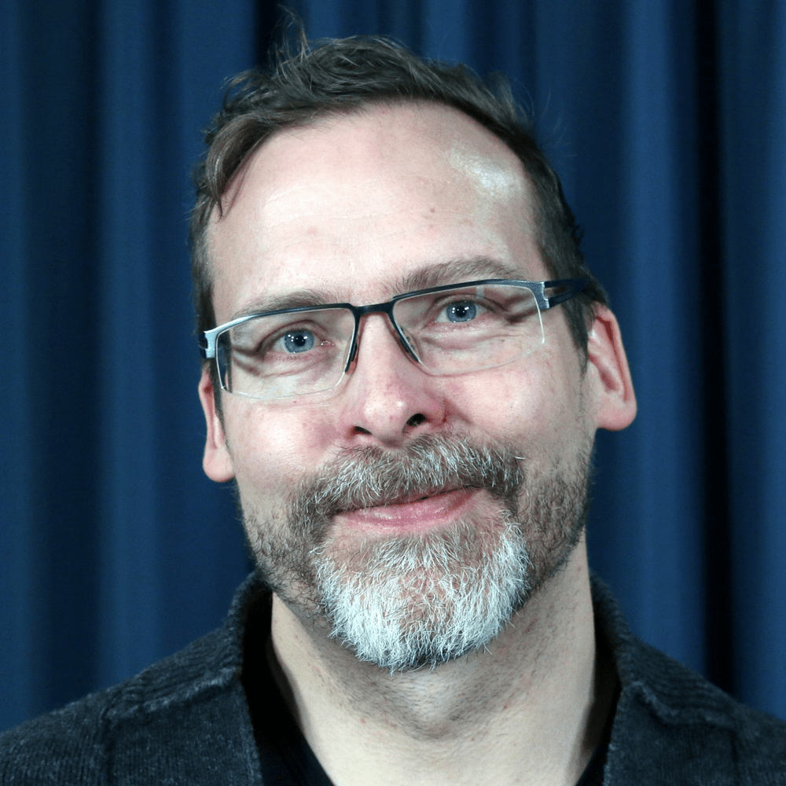 [Jon Marius Aareskjold-Drecker](https://en.uit.no/ansatte/person?p_document_id=93949&p_dimension_id=88175) (UiT)                  |
| **WP6: AI for cultural heritage**                 | 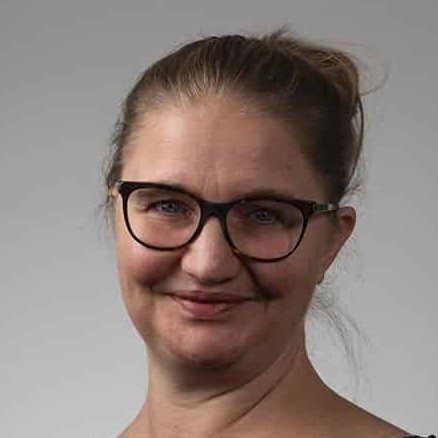 [Ingrid Romarheim Haugen](https://www.nb.no/ansatte/ingrid-romarheim-haugen/) (NB)                                                           | 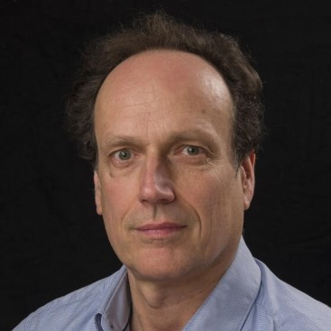 [Arnulf Mattes](https://www4.uib.no/en/find-employees/Arnulf.Christian.Mattes) (UiB)                                              |  [Olivier Lartillot](https://www.uio.no/ritmo/english/people/tenured/oliviel/index.html) (UiO)                                     |
| **WP7: Human-centric AI for Creative Problem-Solving** | 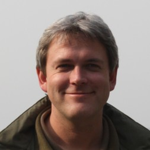 [Carsten Griwodz](https://www.mn.uio.no/ifi/english/people/aca/griff/index.html) (UiO)                                                     | 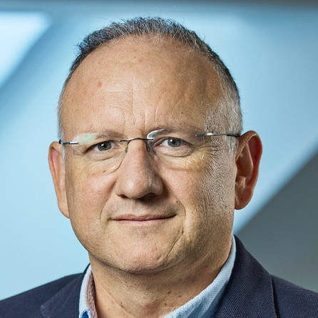 [Baltasar Beferull‐Lozano](https://www.simula.no/people/baltasar) (SimulaMet)                                                     | 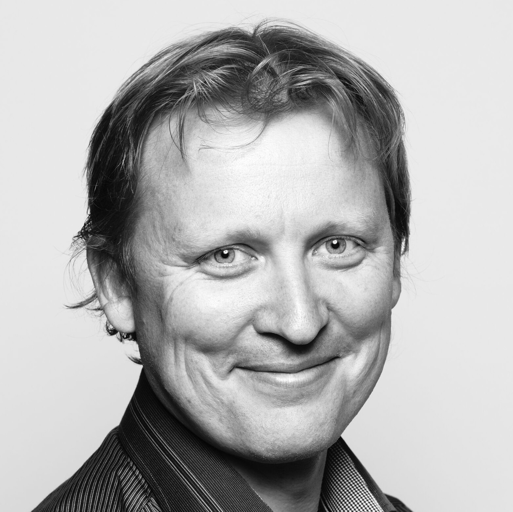 [Kjetil Nordby](https://www.aho.no/english/about/employees/kjetiln/) (AHO)      

## Documents

*Relevant work package plans and progress reports can be found here.*
