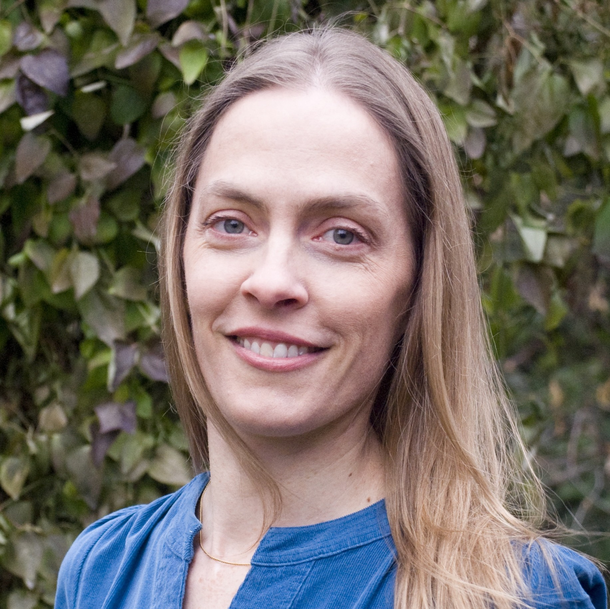
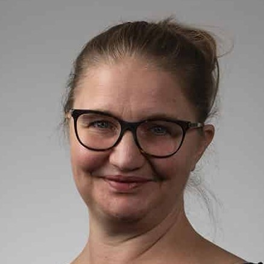
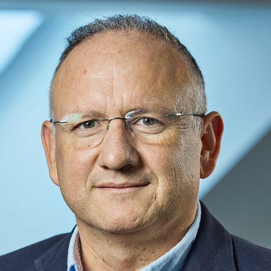

## Who?

### Management group

| | | | | |
|---|---|---|---|---|
|  |  |  |  |  |
| [Alexander Refsum Jensenius](https://www.uio.no/ritmo/english/people/management/alexanje/) (UiO), Director | [Daniel Nordgård](https://www.uia.no/kk/profil/danieln) (UiA), Deputy director | [Ida Jahr](https://www.inn.no/english/find-an-employee/ida-jahr.html) (INN), Deputy director | [Thomas de Ridder](https://www.uib.no/personer/Thomas.de.Ridder) (UiB), Research advisor | [Eskil Muan Sæther](https://www.hf.uio.no/imv/english/people/adm/eskilms/index.html) (UiO), Administrative coordinator |

### Work package leaders

| Work Package                                      | Lead                                                                                                                                         | Sidekick 1                                                                                                                        | Sidekick 2                                                                                                                        |
|---------------------------------------------------|----------------------------------------------------------------------------------------------------------------------------------------------|------------------------------------------------------------------------------------------------------------------------------------|------------------------------------------------------------------------------------------------------------------------------------|
| **WP1: AI for artistic performances**             |  [Kyrre Glette](https://www.mn.uio.no/ifi/english/people/aca/kyrrehg/index.html) (UiO)                                                        |  [Ivar Grydeland](https://nmh.no/kontakt-oss/ansatte/ivar-grydeland) (NMH)                                                     |  [Georgios Marentakis](https://www.hiof.no/iio/itk/english/people/aca/georgiom/index.html) (HiØ)                                   |
| **WP2: AI in artistic processes**                 |  [Budhaditya Chattopadhyay](https://www.uib.no/en/persons/Budhaditya.Chattopadhyay) (UiB)                                                     |  [Sashi Komandur](https://www.inn.no/english/find-an-employee/sashi-komandur.html) (INN)                                            |  [Synne Tollerud Bull](https://www.kristiania.no/en/about-kristiania/employees/school-of-arts-design-and-media/westerdals-department-of-film-and-media/synne-tollerud-bull/) (Kristiania) |
| **WP3: Creative use of AI for health and well-being** |  [Claire Ghetti](https://www.uib.no/en/persons/Claire.Ghetti) (UiB)                                                                          |  [Andreas Bergsland](https://www.ntnu.edu/employees/andreas.bergsland) (NTNU)                                                      |  [Jonna Vuoskoski](https://www.hf.uio.no/imv/english/people/aca/tenured/jonnakv/index.html) (UiO)                                  |
| **WP4: Creative use of AI in education**          |  [Eirik Sørbø](https://www.uia.no/english/about-uia/employees/eiriks05/) (UiA)                                                   |  [Sidsel Karlsen](https://nmh.no/en/contact-us/employees/sidsel-karlsen) (NMH)                                                     |  [Fredrik Graver](https://www.inn.no/english/find-an-employee/fredrik-graver.html) (INN)                                           |
| **WP5: AI in the Creative and Cultural Industries** |  [Ragnhild Brøvig](https://www.hf.uio.no/imv/english/people/aca/tenured/ragnhiba/index.html) (UiO)                                            |  [Irina Eidsvold-Tøien](https://www.bi.no/en/about-bi/employees/department-of-law2/irina-eidsvold-toien/) (BI)                     |  [Jon Marius Aareskjold-Drecker](https://en.uit.no/ansatte/person?p_document_id=93949&p_dimension_id=88175) (UiT)                  |
| **WP6: AI for cultural heritage**                 |  [Ingrid Romarheim Haugen](https://www.nb.no/ansatte/ingrid-romarheim-haugen/) (NB)                                                           |  [Arnulf Mattes](https://www4.uib.no/en/find-employees/Arnulf.Christian.Mattes) (UiB)                                              |  [Olivier Lartillot](https://www.uio.no/ritmo/english/people/tenured/oliviel/index.html) (UiO)                                     |
| **WP7: Human-centric AI for Creative Problem-Solving** |  [Carsten Griwodz](https://www.mn.uio.no/ifi/english/people/aca/griff/index.html)                                                      |  [Baltasar Beferull‐Lozano](https://www.simula.no/people/baltasar) (SimulaMet)                                                     |  [Kjetil Nordby](https://www.aho.no/english/about/employees/kjetiln/) (AHO)                                                       |

### Scientific Advisory Board

-  [Benoit Maujean](https://www.linkedin.com/in/benoit-maujean-7b2b2a1/) (Head of Technicolor Research, France)
-  [Catherine Fisk](https://www.law.berkeley.edu/our-faculty/faculty-profiles/catherine-fisk/) (Prof. law, UC Berkeley, USA)
-  [Jon McCormack](https://research.monash.edu/en/persons/jon-mccormack) (Prof. creative computing, Monash University, Australia)
-  [Jyoti Mistry](https://www.gu.se/en/about/find-staff/jyotimistry) (Prof. film, Gothenburg University, Sweden)
-  [Nancy Baym](https://www.microsoft.com/en-us/research/people/baym/) (Senior Principal Research Manager, Microsoft, New England, USA)
-  [Pamela Burnard](https://www.educ.cam.ac.uk/people/staff/burnard/) (Prof. arts, creativities and educations, University of Cambridge, UK)
-  [Philippe Pasquier](https://www.sfu.ca/siat/people/research-faculty/philippe-pasquier.html) (Prof. interactive arts and technology, Simon Fraser University, Canada)
-  [Psyche Loui](https://web.northeastern.edu/creativity/) (Assoc. Prof. creativity and creative practice, Northeastern University, USA)
-  [Ravi Kiran Sarvadevabhatla](https://www.iiit.ac.in/faculty/ravi-kiran-sarvadevabhatla/) (Assoc. Prof. computer vision and machine learning, IIIT Hyderabad, India)
-  [Sebastian Risi](https://sebastianrisi.com/) (Prof. creative AI, IT University of Copenhagen, Denmark)
-  [Xavier Serra](https://www.upf.edu/web/xavier-serra) (Prof. music technology, Universitat Pompeu Fabra, Spain)
-  [Zhang Qian](https://mra.cuc.edu.cn/yy/2023/0428/c9672a206535/page.htm) (Prof. music and recording art, Communication University of China, China)
